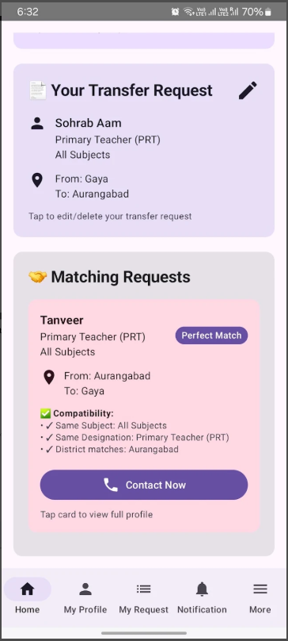
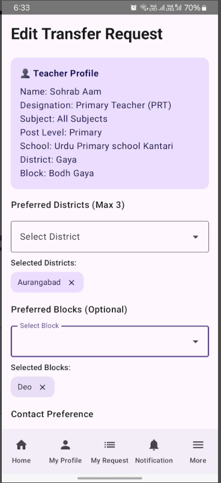
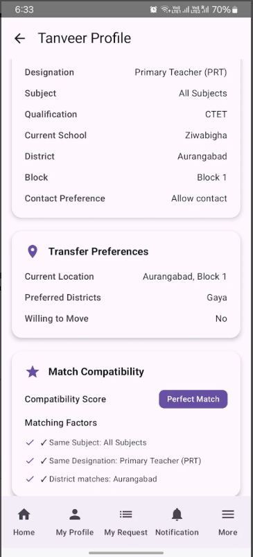
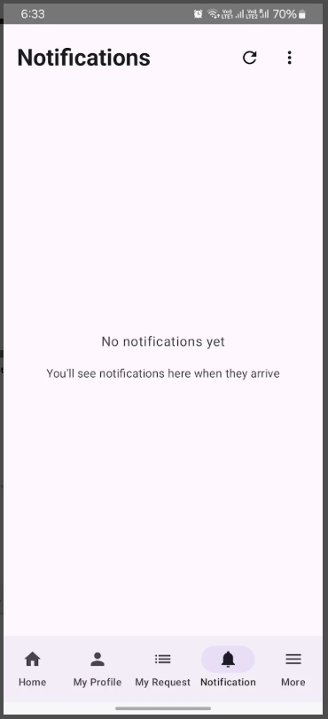

# Mutual Transfer Bihar

An independent Android app that helps Bihar government school teachers find and connect with mutual transfer partners — without paperwork or middlemen.

[](https://play.google.com/store/apps/details?id=com.shikshak.transfer)

**[Download on Google Play](https://play.google.com/store/apps/details?id=com.shikshak.transfer)**

> **Disclaimer:** This is **not** an official government app and is **not** affiliated with the Government of Bihar or its Education Department. All profiles and transfer preferences are submitted by users. For official information, use [state.bihar.gov.in](https://state.bihar.gov.in/), [edu-online.bihar.gov.in](https://edu-online.bihar.gov.in/), [education.bih.nic.in](https://education.bih.nic.in/), or [scert.bihar.gov.in](https://scert.bihar.gov.in/).

## Screenshots

<p>
  
  
  
  
</p>

| Home | Edit request | Match profile | Notifications |
| --- | --- | --- | --- |
| Reciprocal matches with a **Contact Now** action | Set preferred districts and blocks | View compatibility and transfer details | In-app notification inbox |

## Features

- Create and manage your teacher transfer profile
- Select current and preferred district, block, and school
- See matching requests based on district swap, post level, subject, and designation
- Filter by post level (Primary, Upper Primary, High School)
- Contact matched teachers when they allow it
- Phone OTP login, bilingual UI (English / Hindi)
- First-run disclaimer and About & Privacy with official government source links

## Who can use it

Bihar government school teachers looking for a mutual transfer (JBT / TGT / PGT and similar posts).

## Tech stack

- Kotlin, Jetpack Compose, Material 3
- Hilt
- Firebase Auth, Firestore, Cloud Messaging
- minSdk 26 · targetSdk 36 · package `com.shikshak.transfer`

## Getting started (developers)

### Prerequisites

- Android Studio (Meerkat / API 36 SDK or newer)
- JDK 17
- A Firebase project with Phone Auth, Firestore, and FCM

### Build

```bash
git clone https://github.com/md-sohrab-alam/MutualTransferApp.git
cd MutualTransferApp
./gradlew :app:assembleDebug
```

Release builds use gitignored `keystore.properties` (see `keystore.properties.example`). Do **not** put passwords in `gradle.properties`.

```bash
./gradlew :app:assembleDebug
# Signed release (local):
./gradlew :app:assembleRelease :app:bundleRelease
```

- **minSdk** 26 · **targetSdk** 36
- CI: [`.github/workflows/android-build.yml`](.github/workflows/android-build.yml) — signed APK + AAB on `main` / `master` (same flow as Bagh Bakri)
- GitHub Actions secrets: `SIGNING_KEY`, `KEY_STORE_PASSWORD`, `ALIAS`, `KEY_PASSWORD`

See [`docs/SECURITY.md`](docs/SECURITY.md).

## Play listing copy

Store listing drafts (disclaimer + official source URLs) live in [`play-listing/`](play-listing/).

## Privacy

See [`docs/privacy-policy.md`](docs/privacy-policy.md) and the hosted policy at [`public/privacy-policy.html`](public/privacy-policy.html).

## License

This project is licensed under the MIT License.

## Support

Questions or issues: **iamsohrabalam@gmail.com**
